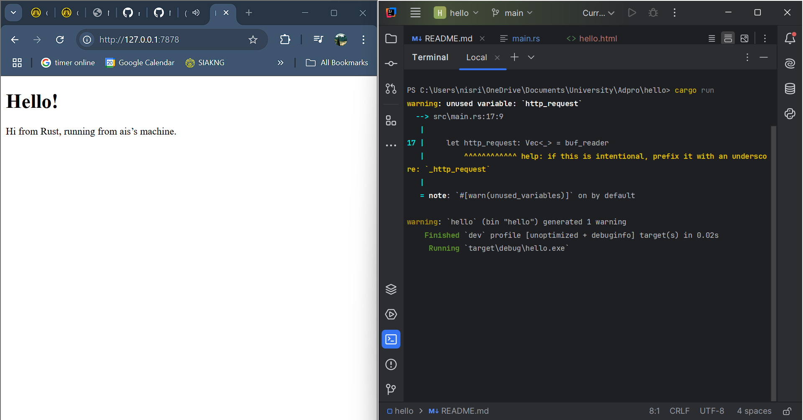
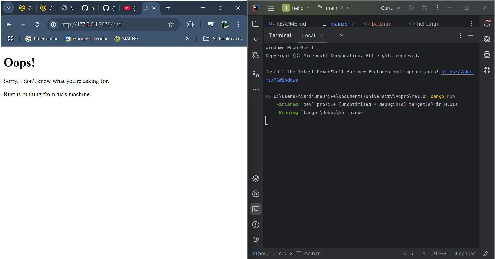

NPM : 2306275960  
Kelas : B**

## Reflection
### Commit 1 Reflection Notes
**Inside the `handle_connection` Method**  
Method `handle_connection` berfungsi untuk menangani setiap permintaan yang dikirim oleh _browser_ atau _client_ ke server. Saat _client_ terhubung ke alamat `127.0.0.1:7878`, permintaan akan dikirim dalam bentuk teks menggunakan protokol HTTP. Fungsi ini membaca permintaan tersebut baris demi baris dan menampilkannya di terminal. Informasi yang dibaca meliputi method permintaan (seperti GET), alamat yang diminta, dan data tambahan tentang _client_. Dengan mengetahui isi permintaan, server dapat memahami kebutuhan _client_ dan menyiapkan respons yang sesuai. Jadi, `handle_connection` menjadi langkah awal untuk memproses permintaan sebelum server merespons.

### Commit 2 Reflection Notes
**Modifications in the `handle_connection` Method**  
Setelah dimodifikasi, method `handle_connection` tidak hanya membaca permintaan dari client, tetapi juga memberikan respons balik ke _client_ dalam bentuk halaman HTML. Setelah permintaan dibaca, fungsi ini menyusun respons HTTP dengan status "200 OK" dan membaca isi _file_ `hello.html`, lalu mengirimkan isi _file_ tersebut sebagai respons ke _client_ melalui koneksi. Dengan perubahan ini, fungsi `handle_connection` tidak hanya berperan mencatat permintaan, tetapi juga menyajikan tampilan yang diminta.

### Commit 3 Reflection Notes
**Request Validation & Response Selection**  
Pada modifikasi ini, server membedakan respons berdasarkan permintaan yang diterima, tidak lagi memberikan hasil yang sama untuk semua URL. Dengan membaca baris pertama dari permintaan, server dapat mengetahui URL yang diminta dan memberikan respons yang sesuai. _Refactoring_ diterapkan untuk memperjelas proses pembacaan dan pemilihan respons sehingga lebih terstruktur dan memudahkan pengembangan.

### Commit 4 Reflection Notes
**Simulating Latency in a Single-Threaded Server**  
Pada modifikasi ini, server dimodifikasi untuk memberikan respons lambat pada URL `/sleep` dengan menambahkan perintah `thread::sleep(Duration::from_secs(10))`. Hal ini membuat server berhenti selama 10 detik sebelum merespons. Karena server berjalan di _single thread_, jika ada pengguna lain yang mengakses server pada waktu bersamaan, permintaan lain harus menunggu hingga proses ini selesai sehingga akses menjadi lambat dan tidak responsif. Simulasi ini menunjukkan keterbatasan _single thread_ dalam menangani banyak permintaan sekaligus dan pentingnya _multi-threading_ agar server bisa lebih efisien melayani pengguna tanpa penundaan.

### Commit 5 Reflection Notes
**Multithreaded server using Threadpool**  
Pada modifikasi ini, server ditingkatkan kemampuannya untuk memproses banyak permintaan sekaligus dengan menerapkan ThreadPool. Sebelumnya, karena server berjalan di single thread, satu permintaan lambat seperti akses ke `/sleep` bisa menyebabkan permintaan lain tertunda hingga proses tersebut selesai. Hal ini membuat server terasa lambat dan tidak tanggap.

Dengan penggunaan ThreadPool, server menjalankan beberapa worker thread yang siap menerima dan memproses tugas secara paralel. Ketika ada permintaan masuk, tugas tersebut dikirim melalui channel ke salah satu worker, lalu diproses menggunakan fungsi `handle_connection`. Dengan cara ini, server dapat menangani beberapa permintaan secara bersamaan tanpa harus menunggu satu per satu sehingga kinerjanya lebih baik dalam melayani banyak pengguna, terutama saat permintaan memerlukan waktu proses yang lama.

### Commit Bonus Reflection Notes
**Function improvement**  
Pada perbaikan ini, fungsi `new` digantikan oleh fungsi `build` untuk membuat objek `ThreadPool`. Perbedaan utama terletak pada cara fungsi tersebut memvalidasi input dan menangani kesalahan. Fungsi `build` menerima parameter `size` yang menunjukkan jumlah _worker_, lalu mengecek apakah nilainya memenuhi syarat. Jika valid, maka objek `ThreadPool` dibuat dan dikembalikan dalam bentuk `Result::Ok`; jika tidak, fungsi akan mengembalikan `Err` beserta pesan kesalahan.

Pendekatan ini membuat pembuatan `ThreadPool` jadi lebih aman karena dapat mencegah kesalahan, seperti menentukan ukuran nol. Dengan menggunakan `Result`, kesalahan bisa ditangani dengan cara yang jelas dan tidak langsung membuat program berhenti seperti pada `new`. Perubahan ini membuat kode lebih stabil dan dapat mencegah kesalahan.